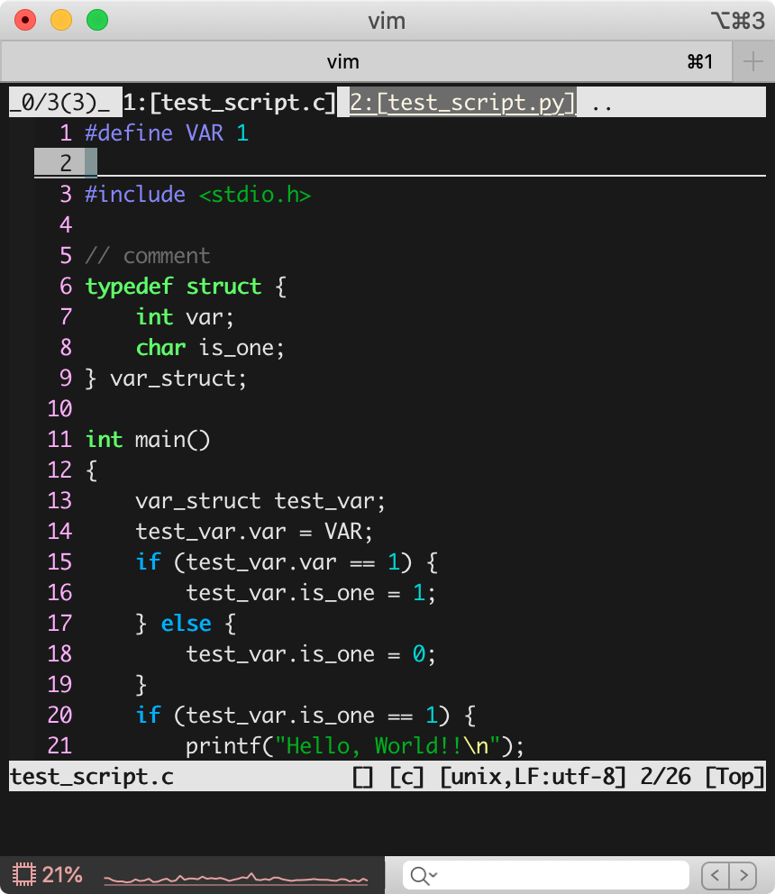
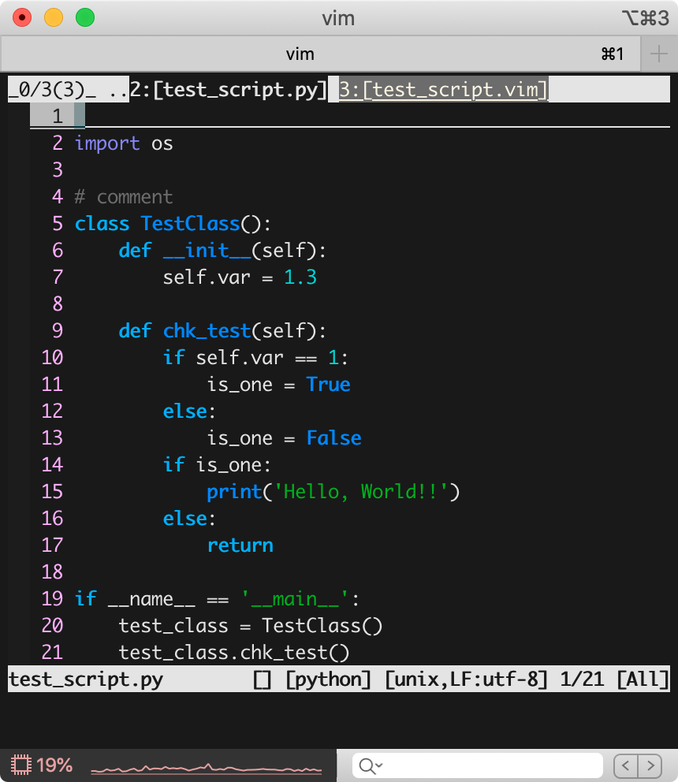
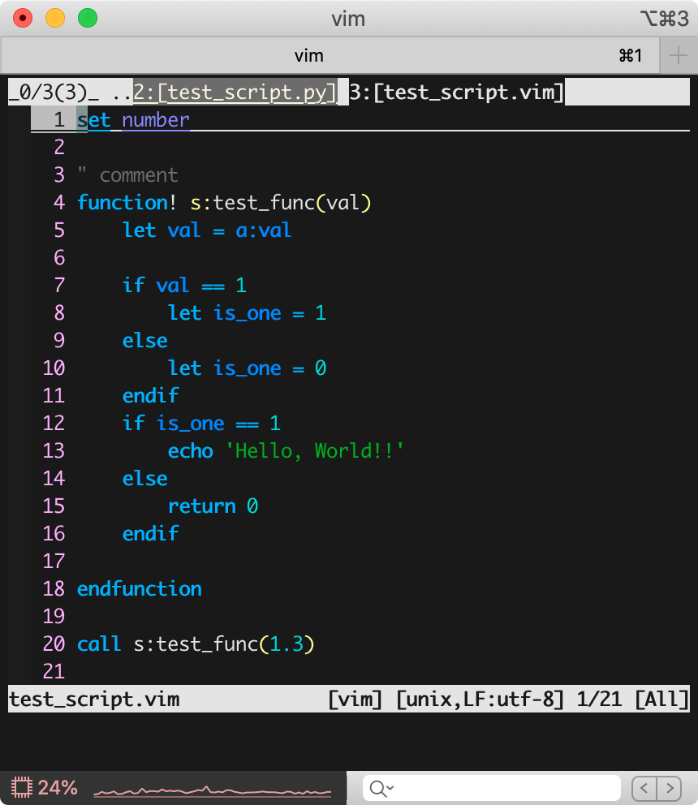

# vim colorscheme shiki (四季)

A vim-colorscheme for dark background.

Concept: Japanese Four seasons (四季:shiki)
- The first impression is **Spring**
    - Japanese cherry, dawn...
- Texts in a function are **Summer**
    - Blue sky, Green leaves, firefly...
- Some function colors, like Diff~ or Pmenu~ are **Autumn**
    - Basically autumn leaves.
- Non-usual texts are **Winter**
    - Snow, Ice, etc...

---
## Screenshots

c, python, vim script

  
